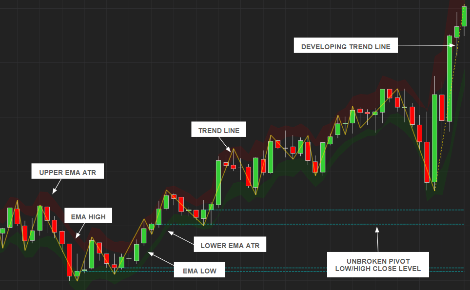

## Think Less. Trade Worse. Use Trust Me, Bro.

## Features

- Guesses with confidence
- Lags just enough to feel real
- Uses some secret sauce and a sprinkle of hope
- Repaints, but like… for good reasons

## Reviews

“I showed this to my hedge fund. They fired me.” – Some Guy

“This indicator ruined my marriage but tripled my account.” – Anonymous Legend

“It’s called Trust Me, Bro. I trusted. It delivered.” – You

Add-On Download: https://github.com/WaleeTheRobot/trust-me-bro/releases

## Secret Sauce

The TrendClassifier evaluates market trends using statistical methods. It combines three trend detection techniques—Ordinary Least Squares (OLS) regression slope, Mann-Kendall tau, and Sen's slope—to produce a normalized trend score between -1 and 1.

**How It Works**

Extracts the most recent prices within the period and computes:

- OLS slope (linear trend strength and direction)
- Mann-Kendall tau (non-parametric trend consistency)
- Sen's slope (robust rate of change)

It then normalizes and weights each metric by its statistical significance and outputs a composite score, where:

+1 = strong uptrend

-1 = strong downtrend

0 = neutral/insignificant trend
